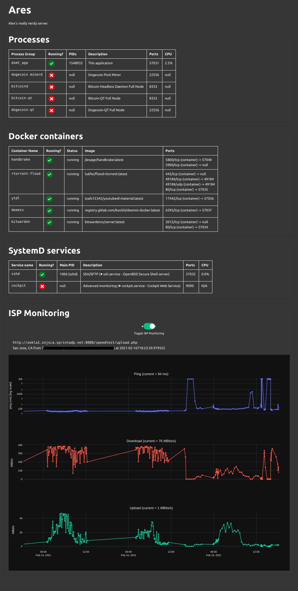

## Dumb simple monitoring tool (`dsmt`)

###### A Web UI server monitoring tool which is dumb simple.

Written in python and plotly dash.





### Motivation

I run a homelab server with various web-UIs and daemon processes spread across systemd services, docker containers, and plain linux processes. I need to monitor when they
are up or go down. Existing tools like Grafana and LibreRMS (among a billion others)
are awesome but are mostly configured for enterprise or structured database access; monitoring simple things like whether a process is running
or not on the server are made quite complicated. I also wanted to monitor the connection my ISP was giving me while giving everyone I lived with the ability to turn the monitoring on/off (to avoid speed-testing lag spikes for video conferencing/gaming/etc.)


DSMT is a super simple and minimal monitoring web UI focused on monitoring *only* the most important thing: whether the services I'm hosting (and our ISP connection) are up or down.

---

### Supports
- Linux system processes and process groups
- Docker containers
- SystemD services
- Periodically checking ISP connection (i.e., what speeds are they really giving me?)

---

###  Install

```
git clone https://github.com/ardunn/dsmt
pip install dmst
```

---

### Configure
Navigate to the `./dmst/config.json` file. This contains an example of
the processes, systemd services, and docker containers dmst can monitor.

##### Processes (`ps`)
Each process is a key-value store which requires:
- **name**: human-facing name of the process
- **query**: the name of the process which must be contained within the desired process(es)' name. 
- **ports**: a list of active ports which are used by this process
- **description**: your description of the process


##### Docker (`docker`)
Docker usage requires only one True/False key. Set the `docker` key to `true` to automatically monitor all docker processes.


##### SystemD (work in progress) (`systemd`)
SystemD processes require the same as regular processes:
- **name**: human-facing name of the process
- **query**: the name of the process which must be contained within the desired process(es)' name. 
- **ports**: a list of active ports which are used by this process
- **description**: your description of the process

##### ISP Monitoring (`isp`)
- `inet_interval`: interval in milliseconds to check the ISP connection
- `inet_days_range`: the number of days to show on the isp monitoring graph

#### DSMT (`dsmt`)

- `update-interval` controls how often the CPU usage is updated.
- `port` determines what port the server runs on.
- `server_name`: the display name of your server
- `description`: the display description of your server

---

### Usage

To run the server in a janky daemon mode, just use `run.sh` in the root directory.

```
source run.sh
```

You can also:

```
python dmst/dmst_app.py
```

Check the end of the `dmst_app.py` file to ensure the server is running in server (not debug) mode.

It runs on port 57031 by default.

